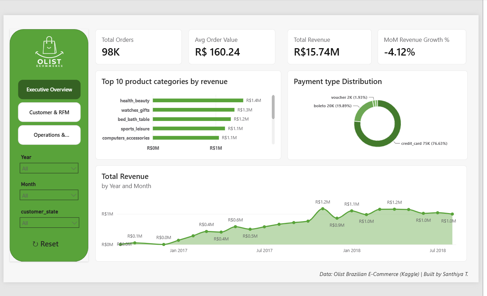

# Brazilian E-Commerce Analytics Dashboard

End-to-end data analytics project on Olist's marketplace data (~99K orders, 2016–2018) —
Python data cleaning, MySQL analysis, statistical testing, and a 3-page Power BI dashboard.

**[Case Study →](case_study/olist_case_study.docx)**

## Business Problem

Olist connects small Brazilian sellers to major online marketplaces. This project answers three
questions a real analytics team would be asked: where is revenue concentrated and is it growing,
how loyal is the customer base, and is delivery performance a risk to customer satisfaction.

## Key Findings

- **R$15.7M revenue** across **98,666 orders** — average order value ~R$160
- Only **3.04% repeat customer rate** — the business is overwhelmingly one-time-buyer, revealing
  a major untapped retention opportunity
- **6.65% late delivery rate** — operationally strong; orders arrive ~12 days ahead of the
  promised delivery date on average
- **76.6%** of orders paid via credit card — installment-based buying is central to the platform
- Delivery delay is statistically significantly correlated with lower review scores (Welch's t-test, p < 0.05)

## Tools & Techniques

| Layer | Tools | Techniques |
|---|---|---|
| Data cleaning | Python, Pandas | Null handling tied to business logic, multi-table merge, deduplication |
| Analysis | MySQL | CTEs, window functions (LAG, RANK, NTILE), RFM segmentation |
| Statistics | Python, SciPy | Correlation, t-test |
| Dashboard | Power BI | Star schema modeling, DAX (DATEADD, RANKX, DIVIDE), Shape Maps |

## Repository Structure

- `notebooks/` — data cleaning and EDA/statistics (Python)
- `sql/` — schema and 6 analytical queries and sample query results (MySQL)
- `dashboard/` — Power BI file and page screenshots
- `case-study/` — 1-page written case study (docx)

## Dashboard Pages

**1. Executive Overview** — revenue trend, top categories, payment distribution, MoM growth

**2. Customer & RFM** — RFM segmentation, repeat customer rate, revenue by state

**3. Operations & Delivery** — delivery delay analysis, late-delivery map, seller ranking

## Recommendations

1. Launch a retention program targeting high-value one-time buyers
2. Tighten estimated delivery windows — real delivery consistently beats the promise by ~12 days
3. Investigate the most recent month's revenue dip to rule out seasonality vs. real decline
4. Promote installment payment options at checkout given credit card's dominant share

## Author

**Santhiya T** — Data Analyst | [LinkedIn](www.linkedin.com/in/santhiya-datanalyst) 
